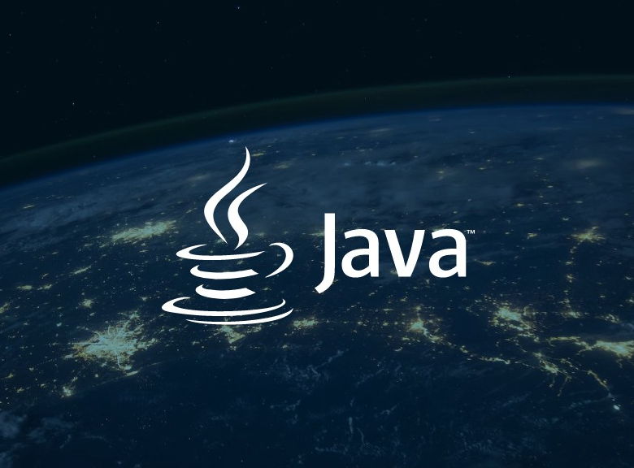

# Markdown Übungsblatt - Exercise 1 Part 1

## Was ist ISupervision?
ISupervision ist ein konsolenbasiertes Java-Verwaltungssystem für Bachelor - und Masterarbeiten.

## Verwendete Technologien
Java ist eine objektorientierte Programmiersprache die plattformunabhängig ist. Sie wird häufig für Desktop- und KOnsolenapplikationen verwendet. 

IntelliJ IDEA ist eine der beliebtesten Entwicklungsumgebungen für Java.
Sie bitet viele hilfreiche Features wue Code-Vervollständigung und Debugging.

## Nützliche Links
[IntelliJ IDEA Download](https://www.jetbrains.com/idea/download/)

## Bilder

