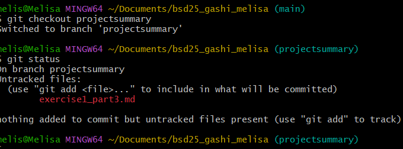

# Exercise 1 Part 3 - GitHub Projekt Übersicht

## Projekt: FreeCodeCamp
[FreeCodeCamp](https://github.com/freeCodeCamp/freeCodeCamp) ist eine Open-Source-Plattform zum Erlernen von Webentwicklung.

Das Projekt bietet tausende Übungen und Zertifikate in Bereichen wie HTML, CSS, JavaScript und Python. Es wird von einer großen Community aktiv weiterentwickelt. 

## Git Status Screenshot
